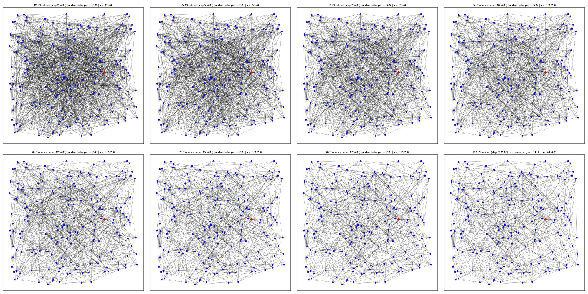
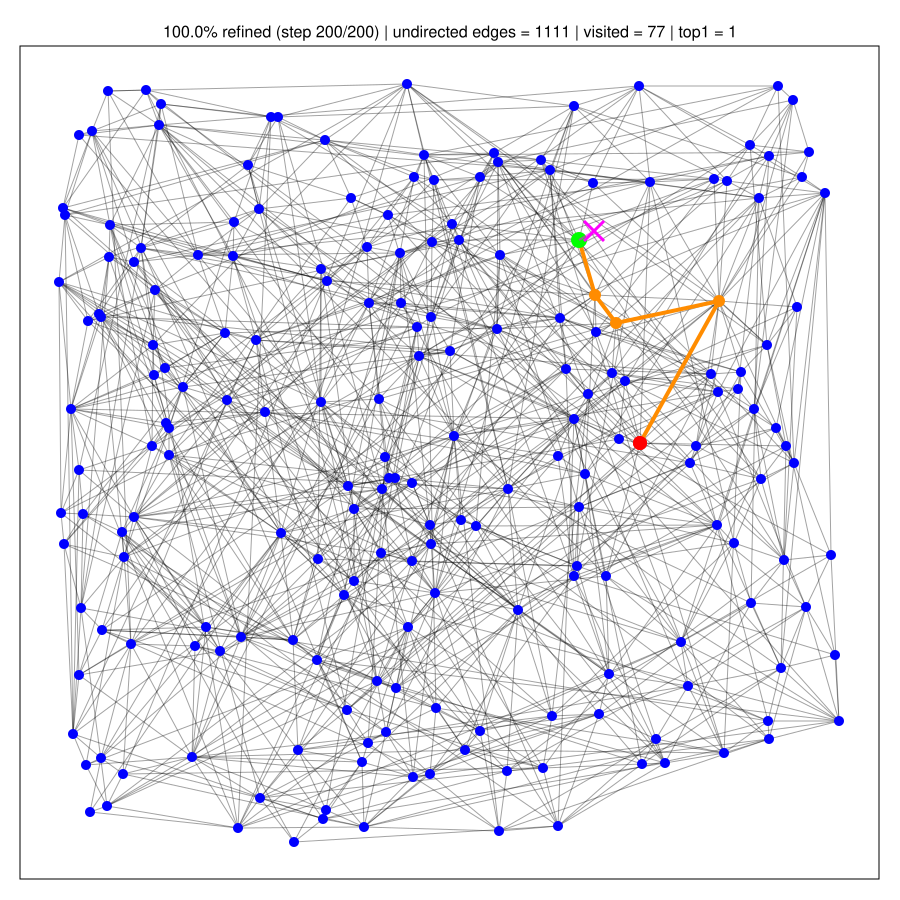

# Rust-DiskANN: Dynamic on-disk graph-based approximate nearest neighbor search with In-Place Insert and Delete 🦀

[](https://crates.io/crates/rust_diskann)
[](https://docs.rs/rust_diskann/latest/rust_diskann/)


A Rust implementation of [DiskANN](https://proceedings.neurips.cc/paper_files/paper/2019/hash/09853c7fb1d3f8ee67a61b6bf4a7f8e6-Abstract.html) using the Vamana graph algorithm. `DiskANN` indexes are always stored and served in the original static mmap format. Updates run in a temporary fixed-layout mmap session and are committed back to a cleaned static index. Deletion follows [MERIT](https://arxiv.org/abs/2607.29173): bounded recovery of approximate in-neighbors, local `k_r`-MST repair, and versioned-edge invalidation during the update session.

## Key Algorithms

### Static Vamana Construction

This implementation follows the DiskANN paper's approach:
- Using the Vamana graph algorithm for index construction, pruning and refinement (in parallel)
- Memory-mapping the index file for efficient disk-based access (via memmap2)
- Implementing beam search with medoid entry points (in parallel)
- Supporting Euclidean, Cosine, Hamming and other distance metrics via a generic distance trait
- Maintaining minimal memory footprint during search operations

### Dynamic MERIT Deletion

Dynamic deletion follows the MERIT algorithm:

1. Logically invalidate the deleted node so it disappears from search immediately.
2. Combine its outgoing neighbors with approximate in-neighbors recovered by a bounded graph search.
3. Reconnect the local candidate set with incremental `k_r`-MST repair and RobustPrune.
4. Increment the deleted slot's version so all stale incoming edges become invalid without a graph-wide scan.
5. Reuse the deleted fixed-capacity slot for a later insertion.

For batch deletion, repair plans declare their candidate-node write sets. Plans with no overlapping writes run in parallel within the same dependency wave. Conflicting plans run in ordered waves, preventing lost adjacency updates without unsafe concurrent mmap writes.

The `k_r`-MST repair caches one symmetric distance matrix per local candidate set. Prim selection and parent ranking therefore compute each candidate-pair distance once instead of repeatedly scanning the original vectors.

### Transient Update Layout

The temporary update workspace keeps fixed-offset regions in one file:

```text
[ metadata and padding to 1 MiB ]
[ vectors: capacity * dim * sizeof(T) ]
[ adjacency targets: capacity * R * u32 ]
[ edge versions: capacity * R * u16 ]
[ node versions: capacity * u16 ]
[ validity bytes: capacity * u8 ]
```

The vector and `u32` adjacency regions retain the static row-major organization. On commit, only live vectors and live version-matching edges are compacted into the ordinary static layout; the temporary workspace is removed. Search-only processes therefore never need validity or version state.

Commit is a sequential pass over the workspace followed by a sequential write of the surviving vectors and adjacency lists. For the intended workload, where each transaction deletes only a small fraction of the database, this is substantially simpler and normally much faster than constructing a fresh Vamana graph. The Fashion-MNIST update example reports the complete update-plus-commit time separately from fresh rebuild time.

## Features

- **Single-file storage**: All index data stored in one memory-mapped file in the following way:

        [ metadata_len:u64 ][ metadata (bincode) ][ padding up to vectors_offset ]
        [ vectors (num * dim * f32) ][ adjacency (num * max_degree * u32) ]

        `vectors_offset` is a fixed 1 MiB gap by default.


- **Vamana graph construction**: Builds an approximate nearest-neighbor graph with progressive RobustPrune. Each prune starts at α = 1.0 to preserve diverse routing edges, then relaxes toward the configured α (default 1.2). The candidate pool is capped at 750, matching the official DiskANN algorithm.
- **Parallel batched graph refinement**: Uses rayon to parallelize candidate generation and batched symmetrization/re-pruning during construction for high build throughput.
- **Build-optimized data layout**:  Uses flat contiguous storage instead of Vec<Vec<T>> during construction to improve cache locality and reduce allocation overhead.
- **Memory-mapped on-disk index**: Stores vectors and fixed-degree adjacency lists in a single file and memory-maps it for low-overhead loading and search.
- **MERIT in-place deletion**: Uses bounded in-neighbor recovery, local `k_r`-MST repair, and versioned-edge invalidation to maintain graph connectivity without rebuilding the index.
- **Transactional updates**: Opens a static index as a fixed-capacity temporary update session supporting `insert`, `insert_batch`, `delete`, and `delete_batch`, then commits an ordinary static index.
- **Conflict-aware parallel repair**: Executes disjoint deletion repair plans concurrently while preserving deterministic ordering for overlapping candidate-node writes.
- **Stale-edge safety**: Stores edge and node versions in parallel fixed-size regions, preventing old incoming edges from becoming valid when a deleted slot is reused.
- **Beam-search query algorithm**: Uses a medoid entry point and beam search over the graph, typically visiting only a small fraction of indexed vectors
- **Generic over vector element type and distance**: Works with generic T and any anndists::Distance<T>, supporting use cases beyond standard floating-point ANN
- **Distance metrics**: Support for Euclidean, Cosine and Hamming similarity et.al. via [anndists](https://crates.io/crates/anndists). A generic distance trait that can be extended to other distances
- **Medoid-based entry points**:  Uses an approximate medoid as the default search entry point
- **Parallel query processing**: Supports concurrent queries with rayon; depending on access patterns, this can increase page activity in the memory-mapped index
- **Minimal memory footprint**: Keeps RAM usage well below full index size by relying on mmap rather than fully loading the index into memory.
- **Extensitve benchmarks**: Speed, accuracy and memory consumption benchmark with HNSW (both in-memory and on-disk)

## Visualization of Vamana graph build and search
The Vamana graph build plot is in 2D with L2 distance. See [diskann-vamana-viz](https://github.com/jianshu93/diskann-vamana-viz) crate for details.

<div align="center">
  
</div>

For search, the final graph was used. The path from entry node (red) to nearest node (green) for the query (pink) in the graph was labeled in orange.

<div align="center">
  
</div>

## Usage in Rust 🦀

### Building a New Index

```rust
use anndists::dist::{DistL2, DistCosine}; // or your own Distance types
use diskann_rs::{DiskANN, DiskAnnParams};

// Your vectors to index (all rows must share the same dimension)
let vectors: Vec<Vec<f32>> = vec![
    vec![0.1, 0.2, 0.3],
    vec![0.4, 0.5, 0.6],
];

// Easiest: build with defaults (M=64, L_build=128, alpha=1.2)
let index = DiskANN::<f32, DistL2>::build_index_default(&vectors, DistL2, "index.db")?;

// Or: custom construction parameters
let params = DiskAnnParams {
    max_degree: 48,        // max neighbors per node
    build_beam_width: 128, // construction beam width
    alpha: 1.2,            // α for pruning
    extra_seeds: 2,        // extra graph-search seeds per node
};
let index2 = DiskANN::<f32, DistCosine>::build_index_with_params(
    &vectors,
    DistCosine {},
    "index_cos.db",
    params,
)?;
```

### Opening an Existing Index

```rust
use anndists::dist::DistL2;
use diskann_rs::DiskANN;

// If you built with DistL2 and defaults:
let index = DiskANN::<f32, DistL2>::open_index_default_metric("index.db")?;

// Or, explicitly provide the distance you built with:
let index2 = DiskANN::<f32, DistL2>::open_index_with("index.db", DistL2)?;
```

### Searching the Index

```rust
use anndists::dist::DistL2;
use diskann_rs::DiskANN;

let index = DiskANN::<f32, DistL2>::open_index_default_metric("index.db")?;
let query: Vec<f32> = vec![0.1, 0.2, 0.4]; // length must match the indexed dim
let k = 10;
let beam = 256; // search beam width

// (IDs, distance)
let hits: Vec<(u32, f32)> = index.search_with_dists(&query, 10, beam);
// `neighbors` are the IDs of the k nearest vectors
let neighbors: Vec<u32> = index.search(&query, k, beam);

```

### Parallel Search

```rust
use anndists::dist::DistL2;
use diskann_rs::DiskANN;
use rayon::prelude::*;

let index = DiskANN::<f32, DistL2>::open_index_default_metric("index.db")?;

// Suppose you have a batch of queries
let query_batch: Vec<Vec<f32>> = /* ... */;

let results: Vec<Vec<u32>> = query_batch
    .par_iter()
    .map(|q| index.search(q, 10, 256))
    .collect();
```

### Insert And Delete Transaction

The static file format and search API remain unchanged. `begin_updates` creates a temporary workspace with a fixed capacity. The normal and required successful completion path is `commit_updates_to_static`: it filters stale edges, compacts live IDs, atomically replaces the destination, removes the workspace, and returns a normal static `DiskANN` plus its ID mapping. The temporary workspace is an implementation detail and is not a persistent searchable index.

```rust
use anndists::dist::DistL2;
use rust_diskann::DiskANN;

let static_index = DiskANN::<f32, DistL2>::build_index_default(
    &vectors,
    DistL2,
    "static.db",
)?;

let mut update = static_index.begin_updates(
    vectors.len() + 10_000,
    1.2,
    "index.update-work",
)?;

// Independent graph searches are parallelized; adjacency commits preserve
// deterministic conflict ordering.
let inserted_ids = update.insert_batch(new_vectors, 128)?;

let stats = update.delete_batch(&ids_to_delete)?;
let (index, old_to_new_id) = update.commit_updates_to_static("static.db")?;
// `index` is an ordinary static index; no version state is needed to search.
// `old_to_new_id[old_slot]` records ID compaction; deleted slots map to `None`.
```

Deleted slots are reused for later inserts; insertion returns an error when the transaction capacity is exhausted. Versioned edges make stale incoming edges immediately invisible during repair and slot reuse. Commit performs the graph-wide sequential cleanup required to remove those versions safely from the final static file.

## Space and time complexity analysis

- **Index Build Time**: O(n * max_degree * beam_width)
- **Disk Space**: n * (dimension * 4 + max_degree * 4) bytes
- **Search Time**: O(beam_width * log n) - typically visits < 1% of dataset
- **Memory Usage**: O(beam_width) during search
- **Query Throughput**: Scales linearly with CPU cores

## Parameters Tuning

### Index building Parameters
- `max_degree`: 32-64 for most datasets
- `build_beam_width`: 128-256 for good graph quality
- `alpha`: 1.2-2.0 (higher = more diverse neighbors)

### Index search Parameters
- `beam_width`: 128 or larger (trade-off between speed and recall)
- Higher beam_width = better recall but slower search

### Index memory-mapping

When host RAM is not large enough for mapping the entire database file, it is possible to build the database in several smaller pieces (random split). Then users can search the query againt each piece and collect results from each piece before merging (rank by distance). This is equivalent to a single big database approach (as long as K'>=K) but requires a much smaller number of RAM for memory-mapping. In practice, the Microsoft Azure Cosmos DB found that this database shard idea can improve recall. Intutively, with smaller data points for each piece, we can use large M and build beam width to further improve accuracy. See their paper [here](https://www.vldb.org/pvldb/vol18/p5166-upreti.pdf)

## Building and Testing

### Logging

The library emits only key lifecycle events through the `log` facade and does not install a logger. Applications can initialize any compatible logger and use `RUST_LOG=info` for build/update/commit events or `RUST_LOG=debug` for MERIT repair summaries. Logging remains disabled by default.

```bash
# Build the library
cargo build --release

# Run tests
cargo test

# Run demo
cargo run --release --example demo
# Run performance test
cargo run --release --example perf_test

# test MNIST fashion dataset
wget http://ann-benchmarks.com/fashion-mnist-784-euclidean.hdf5
cargo run --release --example diskann_mnist

# transactional delete-only, insert-only, and mixed update tests; every round
# commits and reopens a static index before comparison with a fresh rebuild
# static rebuild baseline after every round
cargo run --release --example merit_fashion_rebuild_baselines -- \
    fashion-mnist-784-euclidean.hdf5

# Optional second argument selects update batch size; 60 is 0.1% of 60,000.
cargo run --release --example merit_fashion_rebuild_baselines -- \
    fashion-mnist-784-euclidean.hdf5 60

# test SIFT dataset
wget http://ann-benchmarks.com/sift-128-euclidean.hdf5
cargo run --release --example diskann_sift

# SIFT1M: delete 0.1%, commit a static index, and compare recall/time/QPS
# with a fresh static rebuild. The HDF5 file defaults to the repository root.
cargo run --release --example merit_sift1m_delete
```

### Fashion-MNIST Transaction Results

Version 0.4.1 was tested on all 60,000 Fashion-MNIST vectors (`R=48`, build beam `128`, batches of 3,000). Every round starts from a static index, creates a temporary update workspace, commits a standard static index, and evaluates that committed index against a fresh rebuild over exactly the same active vectors.

At search beam 128:

| Scenario | Rounds | Fresh rebuild | Update + static commit | Speedup | Recall delta range |
|---|---:|---:|---:|---:|---:|
| Delete only | 1-5 | 11.20-13.79 s | 3.51-5.01 s | 2.75-3.19x | -0.00005 to +0.00001 |
| Insert only | 1-5 | 10.72-14.02 s | 6.04-6.57 s | 1.63-2.32x | -0.00004 to +0.00012 |
| Delete + insert | 1-5 | 10.12-10.53 s | 7.68-10.24 s | 0.99-1.35x | -0.00006 to +0.00003 |

The commit cost includes scanning the workspace, filtering version-mismatched edges, compacting IDs, writing all surviving vectors and adjacency lists, removing the workspace, and reopening the result through the ordinary static loader. The benchmark writes detailed per-round results to `merit_fashion_rebuild_baselines.csv`.

For small 0.1% update batches (60 vectors per round), the same benchmark shows the expected larger advantage:

| Scenario | Fresh rebuild | Update + static commit | Mean speedup | Recall delta at beam 128 |
|---|---:|---:|---:|---:|
| Delete only | 13.18-14.42 s | 0.52-0.61 s | 24.51x | -0.00007 to +0.00008 |
| Insert only | 9.35-9.87 s | 0.42-0.48 s | 21.54x | 0.00000 to +0.00008 |
| Delete + insert | 9.31-9.61 s | 0.51-0.59 s | 17.08x | -0.00002 to +0.00003 |

These timings are from one local run and include the complete static commit. They demonstrate why the transactional design is most useful when each update touches a small fraction of a large index.


## Examples

See the `examples/` directory for:
- `demo.rs`: Demo with 100k vectors  
- `perf_test.rs`: Performance benchmarking with 1M vectors
- `diskann_mnist.rs`: Performance benchmarking with MNIST fashion dataset (60K)
- `diskann_sift.rs`: Performance benchmarking with SIFT 1M dataset
- `merit_sift1m_delete.rs`: SIFT1M 0.1% MERIT deletion versus fresh rebuild
- `bigann.rs`: Performance benchmarking with SIFT 10M dataset
- `hnsw_sift.rs`: Comparison with in-memory HNSW

## Benchmark against in-memory HNSW ([hnsw_rs](https://crates.io/crates/hnsw_rs) crate) for SIFT 1 million dataset

```bash
wget http://ann-benchmarks.com/sift-128-euclidean.hdf5
cargo run --release --example diskann_sift
cargo run --release --example hnsw_sift

```

## Results

### SIFT1M Server Run

The following results were measured on the same 1,000,000-vector SIFT dataset with 10,000 queries and strict Recall@10. The search parameters are the tested operating points, not matched-latency settings: DiskANN used search beam 512, while HNSW used `ef_search=64`.

| Index | Build parameters | Search parameter | Build CPU time | Build wall time | Recall@10 | Queries/s |
|---|---|---:|---:|---:|---:|---:|
| DiskANN | `R=64`, `L=128`, `alpha=1.2`, `extra_seeds=1` | beam 512 | 21,080.34 s | 204.10 s | **0.99999** | 14,211.89 |
| HNSW (`hnsw_rs`) | 16 layers, `ef_construction=256` | `ef_search=64` | 8,654.87 s | not reported | 0.98765 | **48,650.67** |

DiskANN returned all requested neighbors, with a mean last-distance ratio of `1.0000006`. HNSW also returned all requested neighbors, with a mean last-distance ratio of `1.0003949`. CPU time can substantially exceed wall time during parallel construction because it is accumulated across worker threads.

### SIFT1M M4 Max Run

```bash
# DiskANN, SIFT1M, M4 Max
DiskANN benchmark on "./sift-128-euclidean.hdf5"
neighbours shape : [10000, 100]

 10 first neighbours for first vector : 
 932085  934876  561813  708177  706771  695756  435345  701258  455537  872728 
 10 first neighbours for second vector : 
 413247  413071  706838  880592  249062  400194  942339  880462  987636  941776  test data, nb element 10000,  dim : 128

 train data shape : [1000000, 128], nbvector 1000000 
 allocating vector for search neighbours answer : 10000
Train size : 1000000
Test size  : 10000
Ground-truth k per query in file: 100

Building DiskANN index: n=1000000, dim=128, max_degree=64, build_beam=128, alpha=1.2, extra_seeds=1
Build complete. CPU time: 3906.747201985s, wall time: 3916.977265733s

Searching 10000 queries with k=10, beam_width=512 …

 mean fraction nb returned by search 1.0

 last distances ratio 1.000009

 recall rate for "./sift-128-euclidean.hdf5" is 0.99971 , nb req /s 24379.064
 total cpu time for search requests 34.90886072s , system time 410.188357ms

 

###  sift1m, hnsw_rs, M4 Max
test_load_hdf5 "./sift-128-euclidean.hdf5"
neighbours shape : [10000, 100]

 10 first neighbours for first vector : 
 932085  934876  561813  708177  706771  695756  435345  701258  455537  872728 
 10 first neighbours for second vector : 
 413247  413071  706838  880592  249062  400194  942339  880462  987636  941776  test data, nb element 10000,  dim : 128

 train data shape : [1000000, 128], nbvector 1000000 
 allocating vector for search neighbours answer : 10000
No saved index. Building new one: N=1000000 layers=16 ef_c=256

  Current scale value : 2.58e-1, Scale modification factor asked : 5.00e-1,(modification factor must be between 2.00e-1 and 1.)
 
 parallel insertion
 setting number of points 50000 
 setting number of points 100000 
 setting number of points 150000 
 setting number of points 200000 
 setting number of points 250000 
 setting number of points 300000 
 setting number of points 350000 
 setting number of points 400000 
 setting number of points 450000 
 setting number of points 500000 
 setting number of points 550000 
 setting number of points 600000 
 setting number of points 650000 
 setting number of points 700000 
 setting number of points 750000 
 setting number of points 800000 
 setting number of points 850000 
 setting number of points 900000 
 setting number of points 950000 
 setting number of points 1000000 
HNSW index saved as: sift1m_l2_hnsw.hnsw.graph / .hnsw.data

 hnsw data insertion cpu time  3014.390977098s  system time Ok(36.777338122s) 
 debug dump of PointIndexation
 layer 0 : length : 999557 
 layer 1 : length : 443 
 debug dump of PointIndexation end
 hnsw data nb point inserted 1000000
searching with ef = 64


 ef_search : 64 knbn : 10 
searching with ef : 64
 
 parallel search
total cpu time for search requests 14137829.0 , system time Ok(156.329364ms) 

 mean fraction nb returned by search 1.0 

 last distances ratio 1.0004259 

 recall rate for "./sift-128-euclidean.hdf5" is 0.98743 , nb req /s 63968.066
```

## License
MIT 
This project is licensed under the MIT License - see the [LICENSE](LICENSE) file for details.

## References
Jayaram Subramanya, S., Devvrit, F., Simhadri, H.V., Krishnawamy, R. and Kadekodi, R., 2019. Diskann: Fast accurate billion-point nearest neighbor search on a single node. Advances in neural information processing Systems, 32.

Zekai Wu, Jiabao Jin, Peng Cheng, Wangze Ni, Haoyang Li, Lei Chen, Junjie Yao, Jingkuan Song, and Heng Tao Shen. 2026. MERIT: Efficient In-Place Deletion for Dynamic Graph-Based Approximate Nearest Neighbor Indexes. [arXiv:2607.29173](https://arxiv.org/abs/2607.29173).
